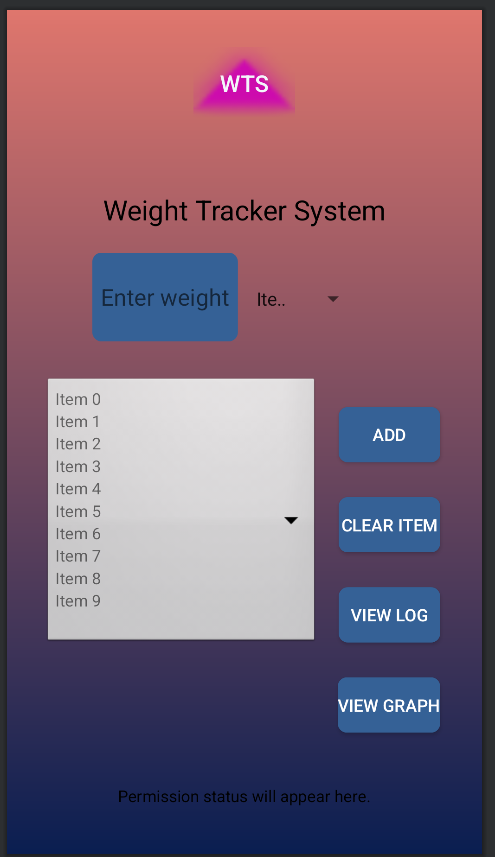

# 📱 CS-360 Mobile Architecture: Weight Tracking App

---

## 📝 Requirements and Goals of the App

The **Weight Tracking App** was designed to help users monitor their daily weight and track changes over time. The primary user needs addressed by this app are:

- **Track Weight**: Allow users to enter their daily weight and view historical data.
- **Data Persistence**: Ensure that data is saved and not lost when the app is closed.
- **Visualize Data**: Provide a way to visualize weight data in a structured format.
- **User Registration and Authentication**: Securely register users and allow them to log in to access their data.
- **Permission Handling**: Request and handle necessary permissions, such as SMS permissions.
- 
## Project Screenshot

---

## 🖥️ Necessary Screens and Features

To support these needs and create a user-centered UI, the following screens and features were developed:

- **Login Screen**: For user authentication.
- **Register Screen**: For user registration.
- **Data Display Screen**: Main screen for entering and viewing weight data, including an option to clear selected items.
- **Weight Log Screen**: Displays historical weight data in a tabular format.
- **SMS Permission Screen**: Requests SMS permissions from the user.

---

## 🎨 UI Design Considerations

Key principles applied during the UI design:

- **Simplicity**:  
  The UI was kept simple and intuitive to ensure ease of navigation.

- **Consistency**:  
  Consistent use of colors, buttons, and fonts to create a cohesive experience.

- **Feedback**:  
  Providing users with immediate feedback (e.g., toast notifications) on their actions, such as successful registration or error messages.

- **Accessibility**:  
  Ensuring elements like text and buttons are appropriately sized and accessible for all users.

The design was successful because it prioritized ease of use, making the app both functional and visually appealing.

---

## 💻 Approach to Coding

The app was developed with these key coding strategies:

- **Modular Development**:  
  The app was broken down into smaller, manageable modules (e.g., separate activities for login, registration, and data display).

- **Database Management**:  
  Using SQLite for data persistence to store user and weight data.

- **RecyclerView**:  
  Implementing RecyclerView to efficiently display weight data in a list.

- **Lifecycle Management**:  
  Properly handling activity lifecycle methods to ensure smooth transitions and data integrity.

- **Permissions Handling**:  
  Ensuring permissions (e.g., SMS) are requested and handled appropriately.

These strategies helped ensure a structured and maintainable codebase, which can be applied in future projects for similar benefits.

---

## 🧪 Testing Process

Testing was an essential part of the development process and included:

- **Unit Testing**:  
  Testing individual components, such as database operations, to ensure correctness.

- **Integration Testing**:  
  Ensuring that different parts of the app (e.g., user authentication, data entry) work seamlessly together.

- **Manual Testing**:  
  Running the app on both an emulator and physical devices to check for UI consistency and functionality.

These tests revealed bugs and ensured the app performed well across different scenarios.

---

## 🚀 Innovation and Challenges

One of the main challenges was ensuring smooth **data persistence** and handling user permissions effectively. Innovating around the use of **SQLite** for data storage and managing Android’s permission system was key. Additionally, ensuring that the app’s UI was responsive and adapted well to different screen sizes required careful design.

---

## 📚 Demonstrating Knowledge, Skills, and Experience

The successful integration of the **SQLite database** for persistent data storage demonstrated my knowledge of database management, SQL queries, and data handling in Android. Furthermore, the use of **RecyclerView** to display dynamic data lists showcased my ability to create efficient and user-friendly interfaces.

---
